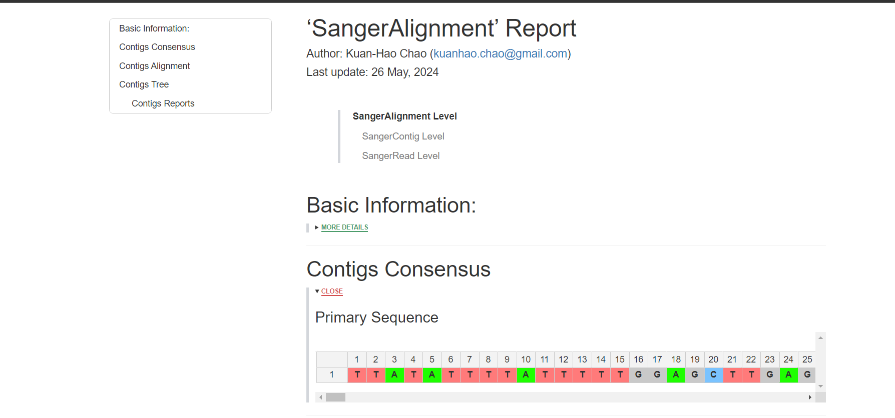
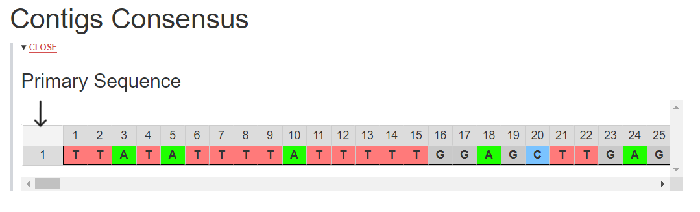
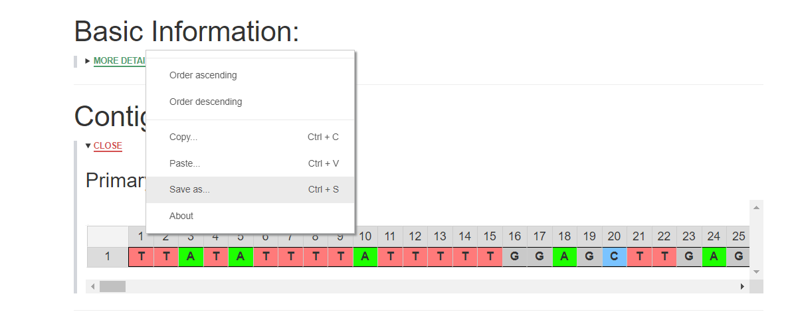

x86-64 Pipeline used to trim and combine sanger raw data to retrieve a consesus read and other results  

If you modify the source code to use on your project please cite:
1. Tsiouri, O. (2024). Sanger analysis pipeline: An x86-64 Pipeline used to trim and combine sanger raw data to retrieve a consesus read and other results v2.0. [https://github.com/olgatsiouri1996/sanger_analysis_pipeline](https://github.com/olgatsiouri1996/sanger_analysis_pipeline)
2. Kuan-Hao Chao, Kirston Barton, Sarah Palmer, and Robert Lanfear (2021). "sangeranalyseR: simple and interactive processing of Sanger sequencing data in R" in Genome Biology and Evolution. DOI: [doi.org/10.1093/gbe/evab028](https://doi.org/10.1093/gbe/evab028)

## Installation
1. Install Docker
2. Install the following containers on your machine:

```shell
docker pull olgatsiouri/sanger_analysis:latest
```

```shell
docker pull olgatsiouri/python-pandas:latest
```

## Usage

The data used were derived from the `sangeranalyseR` and can be found on `input_data.zip`

In order to add the `sangeranalyseR` parameters to be used for trimming and alignment of reads a `parameters.txt` tab seperated file is used.  

## Νotes
1. You can open `parameters.txt` on excel to make modifications
2. Do not change the filename `parameters.txt`
3. Do not change the parameters: printLevel, inputSource, processMethod, ABIF_Directory, FASTA_File, CSV_NamesConversion and geneticCode
4. `parameters.txt` should be in the same folder as the raw `.ab1` files

In order to run the container type the following in ubuntu or intel mac machines:  

```shell
docker run --rm -v /path/to/ab1/folder:/ab1 -v /path/to/save/report:/report -v /path/to/save/fasta:/fasta olgatsiouri/sanger_analysis  
```
on mac silicon:

```shell
docker run --rm --platform=linux/amd64 -v /path/to/ab1/folder:/ab1 -v /path/to/save/report:/report -v /path/to/save/fasta:/fasta olgatsiouri/sanger_analysis  
```

or on windows machines:

```shell
docker run --rm -v C:\path\to\ab1\folder:/ab1 -v C:\path\to\save\report:/report -v C:\path\to\save\fasta:/fasta olgatsiouri/sanger_analysis  
```
This command:

1. Imports the `.ab1` and `parameters.txt` in the container
2. Selects in which folder to generate a report containing the consesus sequence and other data
3. Selects in which folder to save the trimmed reads and their alignment in fasta format

If you want to retrieve the consesus sequence in fasta format do the following:

1. Navigate to the folder you have save the report and open the `SangerAlignment` folder
2. open `SangerAlignment_Report.html`
3. Go to `Contigs Consensus` and click `MORE DETAILS`



4. Click on the top left diagonal box to select the whole consesus sequence



5. right click on `1` to the right of the diagonial box
6. click `save as`



7. This will Download a `jexcel.csv` file that you can use to convert to fasta 
8. download the `consesus_csv_to_fasta.py` from the `src/` folder
9. put the script and `jexcel.csv` at the same directory
10. run docker

on linux/mac os x64-86:

```shell
docker run --rm -it -v /path/to/folder:/data python-pandas /data/consesus_csv_to_fasta.py <input_csv> <fasta_width> <output_fasta>
```
on mac silicon:

```shell
docker run --platform=linux/amd64 --rm -it -v /path/to/folder:/data python-pandas /data/consesus_csv_to_fasta.py <input_csv> <fasta_width> <output_fasta>
```
or on windows:

```shell
docker run --rm -it -v C:\path\to\folder:/data python-pandas /data/consesus_csv_to_fasta.py <input_csv> <fasta_width> <output_fasta>
```
example:

```shell
docker run --rm -it -v /home/linuxubuntu2004/Desktop:/data python-pandas /data/consesus_csv_to_fasta.py jexcel.csv 80 drosho_consesus.fasta
```
The output fasta file will look like:
```s
>consesus_seq
TTATATTTTATTTTTGGAGCTTGAGCTGGAATAGTTGGAACATCTTTAAGAATTTTAATT
CGAGCTGAATTAGGACATCCTGGAGCATTAATTGGAGATGATCAAATTTATAATGTAATT
GTAACTGCACATGCTTTTATTATAATTTTTTTTATAGTTATACCTATTATAATTGGTGGA
TTTGGAAATTGATTAGTGCCTTTAATATTAGGTGCTCCTGATATAGCATTCCCACGAATA
AATAATATAAGATTTTGACTTCTACCTCCTGCTCTTTCTTTACTATTAGTAAGTAGAATA
GTTGAAAATGGAGCTGGGACAGGATGAACATGTTTATCCACCTCTATCCGAGCTGGAATT
GCTCATGGTGGAGCTTCAGTTGATTTAGCTATTTTTTCTCTACATTTAGCAGGAATTTCT
TCAATTTTAGGAGCTGTAAATTTTATTACAACTGTAATTAATATACGATCAACAGGAATT
TCATTAGATCGTATACCTTTATTTGTTTGATCAGTAGTTATTACTGCTTTATTATTATTA
TTATCACTTCCAGTACTAGCAGGAGCTATTACTATATTATTAACAGATCGAAATTTAAAT
ACATCATTTTTTGACCCAGCGGGAGGAGGAGATCCTATTTTATACCAACATTTATT
```